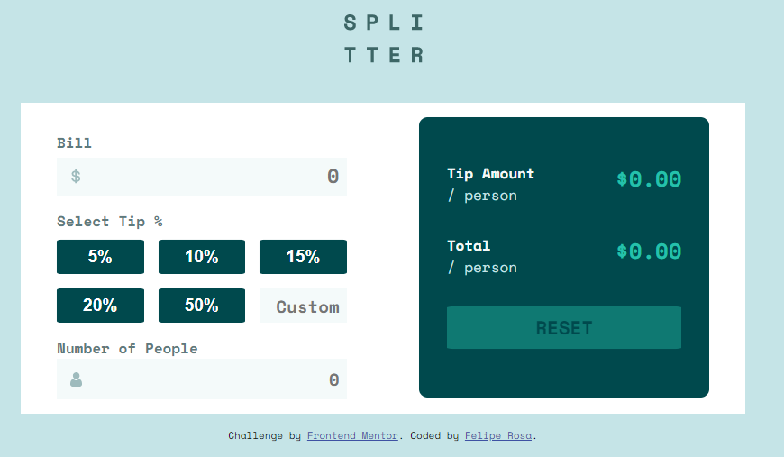

# Frontend Mentor - Tip calculator app solution

This is a solution to the [Tip calculator app challenge on Frontend Mentor](https://www.frontendmentor.io/challenges/tip-calculator-app-ugJNGbJUX). Frontend Mentor challenges help you improve your coding skills by building realistic projects.

## Table of contents

- [Overview](#overview)
  - [The challenge](#the-challenge)
  - [Screenshot](#screenshot)
- [My process](#my-process)
  - [Built with](#built-with)
  - [What I learned](#what-i-learned)
  - [Continued development](#continued-development)

## Overview

I challenged myself to make this webapp step by step without any help to see how my knowledge of JS and SCSS was

### The challenge

Users should be able to:

- View the optimal layout for the app depending on their device's screen size
- See hover states for all interactive elements on the page
- Calculate the correct tip and total cost of the bill per person

### Screenshot

## My process

I started building with HTML and then SCSS.
I used SCSS very little, I learned it existed but hadn't used it to do anything, I decided to force myself to use it during this project.
First project with javascript on the page that I do alone without following guides.

### Built with

- Semantic HTML5 markup
- CSS custom properties
- Flexbox
- CSS Grid
- Mobile-first
- SCSS

### What I learned

By forcing myself to use SCSS I was able to learn more about the compiler, I really liked what I learned and I intend to use it more often in the future.

I put into practice the JavaScript listen events, learning more how to make the page more interactive

### Continued development

I want to continue using SCSS in the future and dig deeper into this way of writing CSS

I need to improve and make my code cleaner by practicing more what I've been reading in Clean Code
